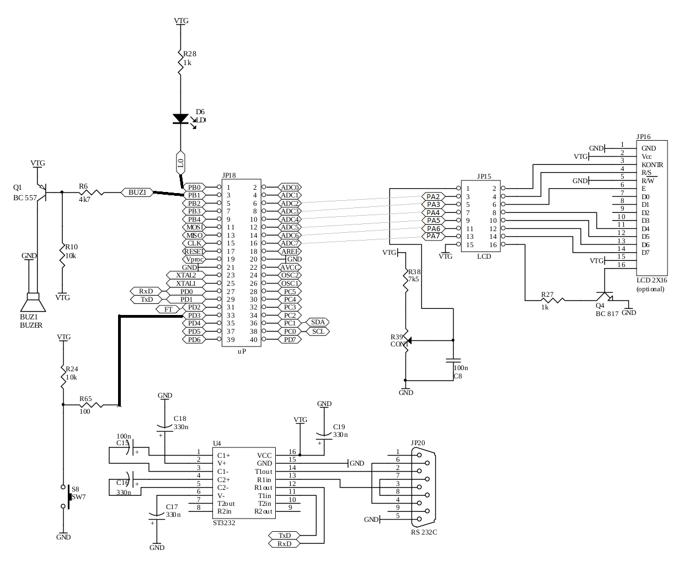

# Licznik pomodoro
** Dominik Stańczak **

Omawiane urządzenie jest sprzętową implementacją licznika Pomodoro na podstawie mikrokontrolera AVR ATmega32.

### Funkcjonalność:
* Odmierzanie czasu pracy oraz czasu przerwy w pracy w trosce o wydajność, produktywność, zdrowie, dobre samopoczucie i satysfakcję życiową użytkownika końcowego
* Czytelny wyświetlacz LCD Hitachi HD44780 pozwala na zorientowanie się w obecnej sytuacji w mgnieniu oka.
    * Może wyświetlać śladowe ilości chińskich krzaczków.
* Subtelne powiadomienie starannie dobranym czasem trwania dźwięku bzyczka oraz zapaleniem diody o nadejściu czasu na przejście do kolejnej fazy pracy
* Obsługa stanu flow - użytkownik sam wybiera, kiedy chce rozpocząć przerwę lub wrócić do pracy
* Możliwość ręcznego ustawiania czasu pracy lub przerwy z poziomu komputera użytkownika poprzez interfejs RS232C USART
    * Aż `0b10` komend!
    * Możliwość ustawienia czasu pracy i czasu przerwy w zakresie do jednej godziny, co daje aż 12 milionów możliwych trybów poprawnej pracy
        * I prawdopodobnie **NIESKOŃCZONĄ LICZBĘ TRYBÓW PRACY** uwzględniając wszystkie sposoby, w jaki program może się wykrzaczyć!
* Pomiar czasu zrealizowany bez używania liczników mikrokontrolera przy użyciu zegara DS1307 w celu poprawy niezawodności, zwiększenia niezawodności działania urządzenia oraz uniknięcia konieczności myślenia nad preskalerem!
* Nasi naukowcy (rozmiar grupy statystycznej *N = 1*) gwarantują *z 50% pewnością* przydatność urządzenia.

### Obsługa
1. Po uruchomieniu licznik zaczyna odliczać sesję roboczą, o domyślnej długości 30 minut.
2. Po zakończeniu sesji roboczej licznik wyświetla powiadomienie o zakończeniu sesji roboczej i rozpoczęciu przerwy, które należy potwierdzić przyciskiem.
3. Po zakończeniu przerwy należy potwierdzić rozpoczęcie kolejnej sesji roboczej poprzez wciśnięcie przycisku.
* Aby zmodyfikować ustawienia, należy połączyć się z urządzeniem poprzez interfejs RS232 i wpisać:
    * Aby ustawić czas pracy: `WMM:SS`, gdzie `MM` to liczba minut sesji, `SS` to *wbrew pozorom* liczba sekund sesji
    * Aby ustawić czas przerwy: `BMM:SS`, gdzie `MM` to liczba minut przerwy, `SS` to liczba sekund przerwy

### Kod programu
W pełni opensource'owy, dostępny na [repozytorium GitHub www.github.com/StanczakDominik/psm-pomodoro](www.github.com/StanczakDominik/psm-pomodoro).

### Wykorzystane elementy
1. Mikrokontroler AVR ATmega32
2. Zegar DS1307
3. Wyświetlacz LCD Hitachi HD44780
4. Głośnik
5. Dioda LED (sztuk 1)

### Połączenie RS232C
* Baud rate: 115200
* Data bits: 8
* Stop bits: 2
* Parity: NONE
* Handshake: bez
* Znak końca linii: `LF`

Do obsługi komunikacji polecam np. linuxowy `cutecom`.

## Schemat urządzenia

### Połączenia
* Zegar:
    * SCL (MISC) -> PC0 (SCL sprzętowe)
    * FT (MISC) -> PD2 (INT0 sprzętowe)
    * SDA (MISC) -> PC1 (SDA sprzętowe)
* Wyświetlacz LED:
    * RS -> PA2
    * E -> PA3
    * D4-7 -> PA4-7
* Interfejs RS232C
    * MISC RXD -> PD0 (RXD)
    * MISC TXD -> PD1 (TXD)
* Interfejs użytkownika
     * Dioda: LDx -> PB0
     * Bzyczek:  SPK -> PB1
     * Przycisk: SW7 -> PD3 (INT1)
